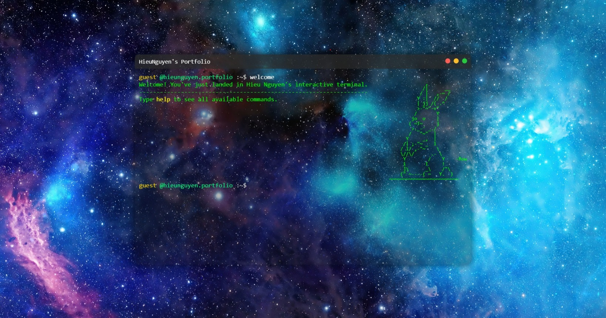
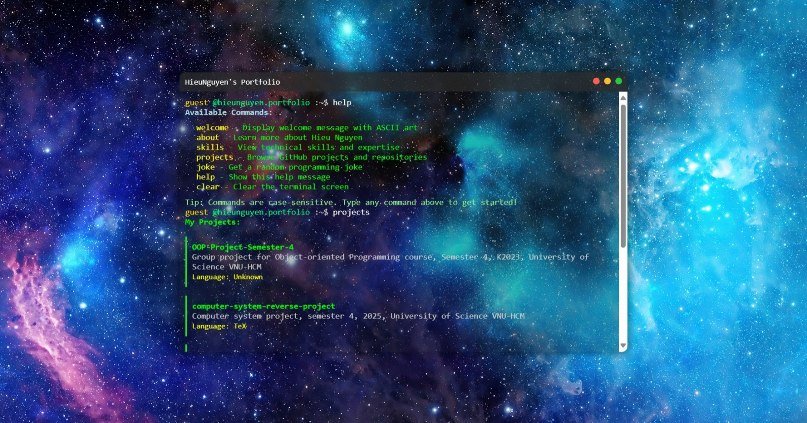

# 💻 Terminal Portfolio

<div align="center">


**An interactive terminal-style portfolio showcasing Hieu Nguyen's skills and projects**


</div>

---

## 🎯 Overview

This project is a **terminal-style portfolio** that mimics a real command-line interface, providing an engaging and interactive way to explore my professional background, skills, and projects. Built with vanilla JavaScript, it offers a unique user experience that stands out from traditional portfolios.

## 📸 Screenshots

### Welcome Screen

*Interactive terminal interface with ASCII art and welcome message*

### Commands in Action

*Demonstrating various commands and their outputs*

## ✨ Features

### 🎮 Interactive Commands
- **`welcome`** - Display welcome message with beautiful ASCII art
- **`about`** - Personal information and background
- **`skills`** - Technical skills and expertise overview
- **`projects`** - Live GitHub repositories fetched via API
- **`joke`** - Random programming jokes for entertainment
- **`help`** - Complete command reference guide
- **`clear`** - Clear terminal screen

### 🎨 Design Features
- **Authentic Terminal Look** - Realistic command-line interface
- **Draggable Window** - macOS-style terminal window with drag functionality
- **Responsive Design** - Works seamlessly on all devices
- **Syntax Highlighting** - Color-coded output for better readability
- **Smooth Animations** - Enhanced user experience with CSS transitions
- **ASCII Art Integration** - Creative visual elements

##  Project Structure

```
terminal-portfolio/
├── 📄 index.html          # Main HTML file
├── 📁 css/
│   └── 🎨 style.css       # Styling and animations
├── 📁 js/
│   ├── ⚡ main.js         # Core application logic
│   └── 🔧 commands.js     # Command implementations
├── 📁 assets/
│   ├── 📁 img/            # Images and graphics
│   └── 📁 sreenshort/     # Project screenshots
└── 📋 README.md           # Project documentation
```

## 🎯 Usage

### Basic Commands
Type any of the following commands in the terminal:

```bash
# Get started
welcome

# Learn about me
about

# View my skills
skills

# Browse my projects
projects

# Need help?
help

# Clear the screen
clear

# Get a laugh
joke
```

### Advanced Features
- **Window Dragging**: Click and drag the terminal header to move the window
- **Auto-scroll**: Terminal automatically scrolls to show the latest output
- **Command History**: Use arrow keys to navigate through command history
- **Real-time Data**: Projects are fetched live from GitHub API

## 🔌 API Integration

### GitHub API
The portfolio integrates with GitHub's REST API to fetch real-time repository data:

```javascript
// Fetches latest repositories
GET https://api.github.com/users/JakeConal/repos?sort=updated
```

### Joke API
Random programming jokes powered by JokeAPI:

```javascript
// Fetches programming jokes
GET https://v2.jokeapi.dev/joke/Programming?type=single
```

## 🎨 Customization

### Adding New Commands
1. Create a new function in `js/commands.js`:
   ```javascript
   export function newCommand() {
       return `<span style="color: green;">Your output here</span>`;
   }
   ```

2. Import and add to command map in `js/main.js`:
   ```javascript
   import { newCommand } from './commands.js';
   
   const commandMap = new Map([
       ['new', newCommand],
       // ... other commands
   ]);
   ```

### Styling
Customize the appearance by modifying `css/style.css`:
- Terminal colors and theme
- Font families and sizes
- Animation effects
- Window styling

## 📧 Contact

**Hieu Nguyen** - Full Stack Developer

- 📧 Email: [hieunguyen.jc@gmail.com](mailto:hieunguyen.jc@gmail.com)
- 🐱 GitHub: [@JakeConal](https://github.com/JakeConal)


---

<div align="center">

**⭐ If you found this project helpful, please give it a star! ⭐**

Made with ❤️ by [Hieu Nguyen](https://github.com/JakeConal)

</div>
